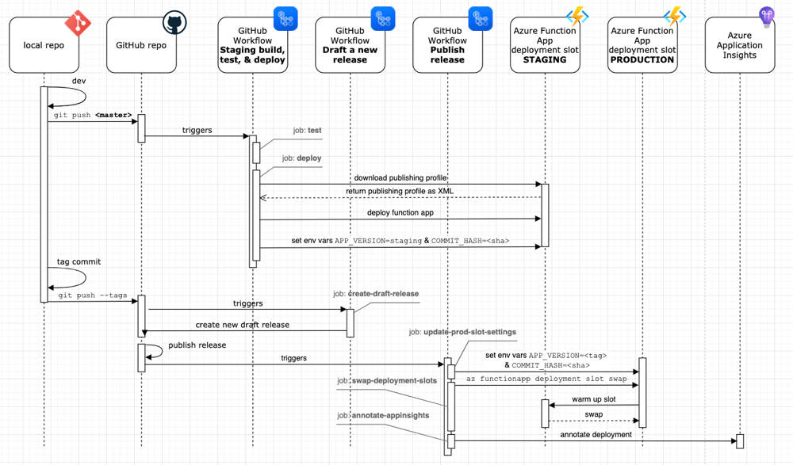

# From Processor

Handles processing of forms on Vointaos.io.

## Azure Functions in this project

### [Heartbeat](./heartbeat)

Used to ensure the function app has deployed.

### [Enqueue Submissions(./enqueue-submissions)

Receives all form submissions from Voitanos.io & saves them to the specified Azure Storage Queue.

The queue the form submission is saved to is defined by the `formid` in the URL: `https://url/enqueue-submissions/formid`. In this case, the submission is saved to the queue `formid`.

### Response & redirection

If the form fields include one named `redirectUrl`, when the form is successfully submitted, the function responds with `HTTP 308` & includes this URL in the `Location` header of the response.

Otherwise, if there's no field is set, the response is `HTTP 200 OK`

## Deployment

All deployment to the Azure resource that hosts this Azure Function app is managed through GitHub actions. These cover the following scenarios:

1. development of functions (*ie: off the **master** branch*)
1. deployment to production (*ie: on the **master** branch*)

### Development of functions

All development of functions on branches **!master** or **!development**  are automatically built & tested by the [Build app & run all tests](./.github/workflows/build-test.yml) workflow.

When a branch is pushed to any branch other than the **master** branch, this workflow builds & runs all unit tests.

Nothing is deployed in this case.

The Azure Function **staging** slot is used a pre-production. Any push to the **master** or **development** branches are considered a production deployment.

> **NOTE:**
> The new feature branches can be sync'd & merged with the **development** branch to trigger deployment to staging. This enables testing the Azure Function in a real world environment.

A manual publish of a draft release triggers the production slot swapping.

### GitHub actions workflows used in deployment

- Step 1: [Staging build, test & deploy app](./.github/workflows/test-deploy-to-staging.yml)
- Step 2: [Draft a new release](./.github/workflows/draft-release.yml)
- Step 3: [Publish release (swap deployment slots)](./.github/workflows/deploy-release.yml)
